# Arena LLM

Banco de pruebas **independiente del hardware** para modelos de IA locales (llama.cpp). Es una web local para **medir, enfrentar y comparar modelos** en cualquier equipo y tarjeta, con la telemetría del equipo (cada GPU, CPU y RAM) siempre a la vista.

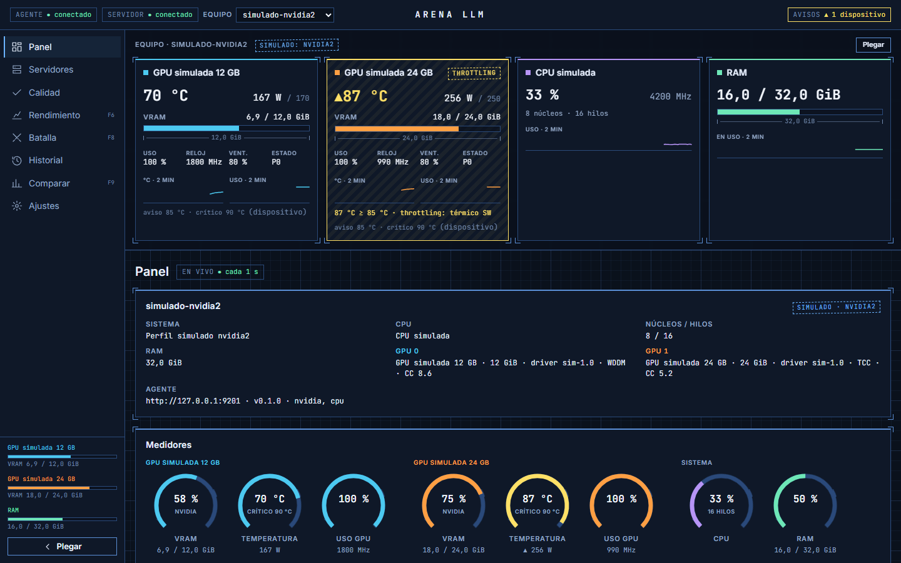

> Estado: fases F1–F6 hechas (telemetría, detección de servidores, calculadora de encaje con comando de arranque, estrés, prompt libre con biblioteca y rendimiento por componente con `llama-bench`). Ver [`ESTADO.md`](ESTADO.md) y [`docs/HOJA-DE-RUTA.md`](docs/HOJA-DE-RUTA.md).
>
> Todas las capturas están hechas con el **modo simulado** (perfiles `nvidia2` y `cpu-only`, `llama-server` simulados y GGUF falsos): no hay datos ni rutas reales.

## Qué hace

1. **Muestra siempre el estado del equipo** (cada GPU, CPU y RAM) para ver de un vistazo que no pasa nada raro.
2. **Detecta sola** qué modelo, contexto y flags tiene cada `llama-server` y lo guarda con cada prueba.
3. **Prueba y compara**: estrés, prompt libre y rendimiento por componente. En próximas fases llegarán calidad, batallas A contra B y comparación de resultados.

## Funcionalidades

### Telemetría en vivo

Temperatura, potencia, VRAM, uso, relojes, ventilador, estado P y throttling de cada GPU, más CPU y RAM, cada segundo por SSE. Cada tarjeta conserva su color en toda la interfaz, y los avisos salen de los umbrales de cada dispositivo.

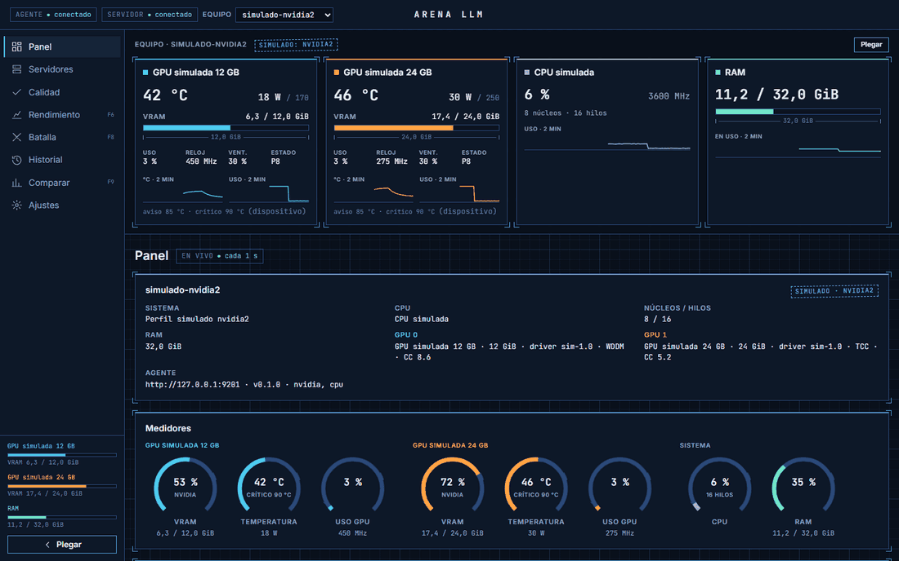

<sub>Acelerado ×2.</sub>

### Detección de servidores

Arena detecta los `llama-server` que lanzas tú (proceso, `/props`, `/slots`, `/v1/models`): modelo, cuantización, contexto por slot, flags y en qué GPU corre. Cada 5 s vuelve a mirar y registra cualquier cambio de configuración con su diff.

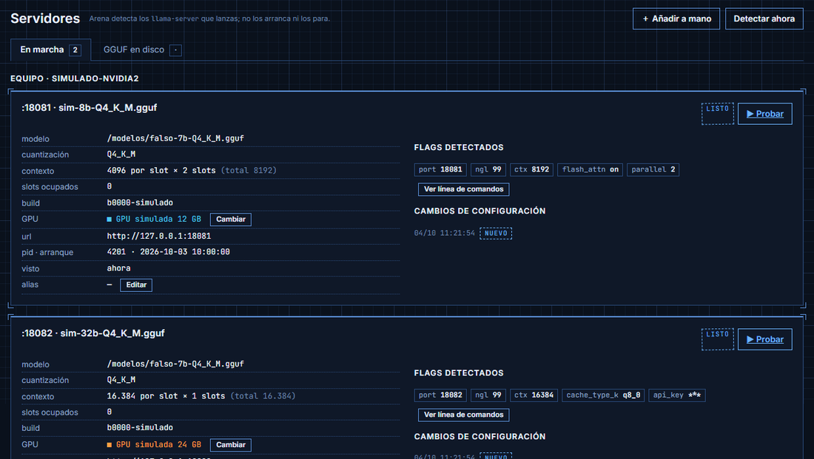

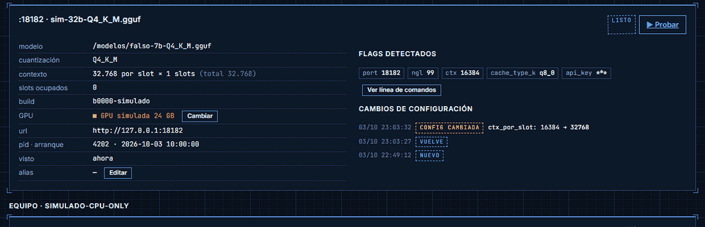

<sub>Acelerado ×1,5. El servidor se para ("sin respuesta"), vuelve a arrancar con otro contexto y el cambio queda registrado con su diff.</sub>

También se pueden **dar de alta endpoints a mano** (por ejemplo, un servidor que el agente no ve como proceso) y **asignar GPU a mano** cuando la detección no puede.

### Calculadora de encaje de GGUF

Pestaña **GGUF en disco**: lee la cabecera de cada GGUF de las carpetas permitidas y estima pesos por capa, caché KV, búfer de cómputo y reserva por GPU. El veredicto se compara con la VRAM y la RAM **libres ahora**: cabe en una GPU, cabe repartido, necesita RAM (con el `-ngl` sugerido), solo CPU o no cabe. Todo lleva el sello `ESTIMADO`.

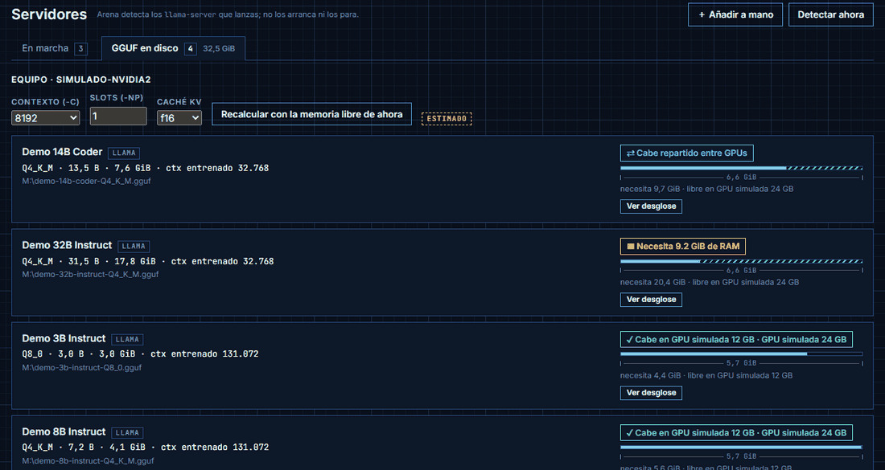

### Comando de `llama-server` listo para copiar

En cada GGUF que cabe, **Ver comando** compone la línea para arrancarlo con lo que ha calculado la calculadora: binario detectado, `-m`, `-c`, `-ngl` sugerido, `-np`, tipo de caché KV, `-fa on` y un `--port` que no usa ningún servidor detectado. Si cabe en varias GPU, eliges en cuál (`-dev`); si va repartido, añade `-ts` según la memoria libre. Sale en la sintaxis de cmd y PowerShell en Windows, o de bash en Linux. Arena no lo lanza: lo copias y lo ejecutas tú.

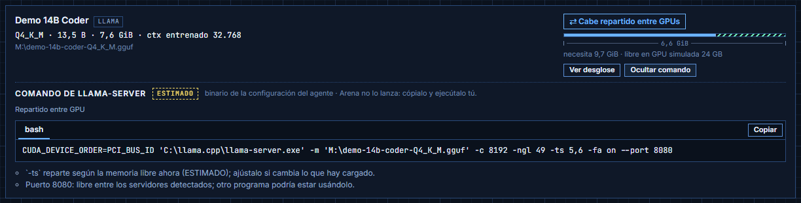

El binario sale de la configuración del agente (`llama_server`, o el `llama-server` que haya junto a `llama_bench`). Si no está, sale del último `llama-server` detectado y, si tampoco hay, se supone en el `PATH`, con un aviso. Con `-dev` o `-ts` el comando fija `CUDA_DEVICE_ORDER=PCI_BUS_ID` para que `CUDA0, CUDA1…` coincidan con el orden de `nvidia-smi`.

### Prueba de estrés

Peticiones largas en bucle durante el tiempo elegido, con fases de reposo, carga y enfriamiento. Gráficas de t/s, temperatura, potencia de placa y reloj sincronizadas, y aborto automático si una GPU llega a su umbral crítico.

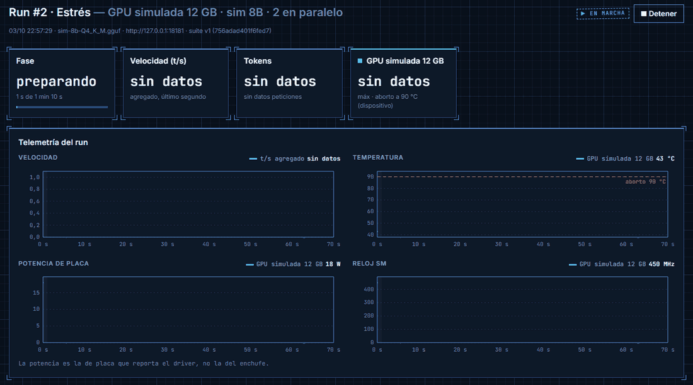

<sub>Acelerado ×4.</sub>

Al terminar queda el resultado completo: resumen (mediana de t/s, TTFT, degradación, energía y tokens por Wh, throttling), la **foto de configuración** guardada con el run (servidor, flags, modelo y parámetros) y cada petición.

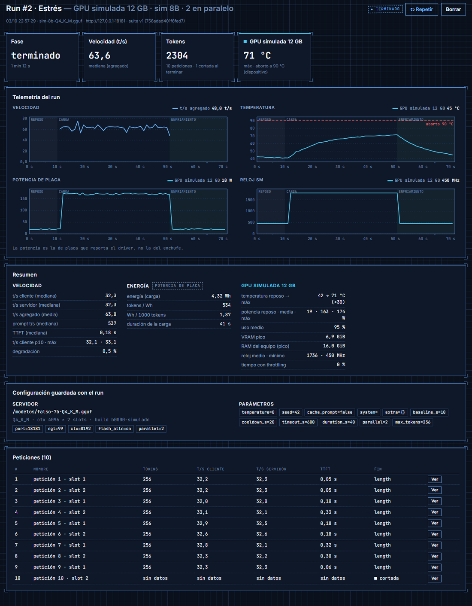

### Prompt libre en streaming y biblioteca de prompts

Uno o varios prompts propios con repeticiones. La respuesta llega en streaming y se miden TTFT, t/s del cliente y del servidor, y tokens.

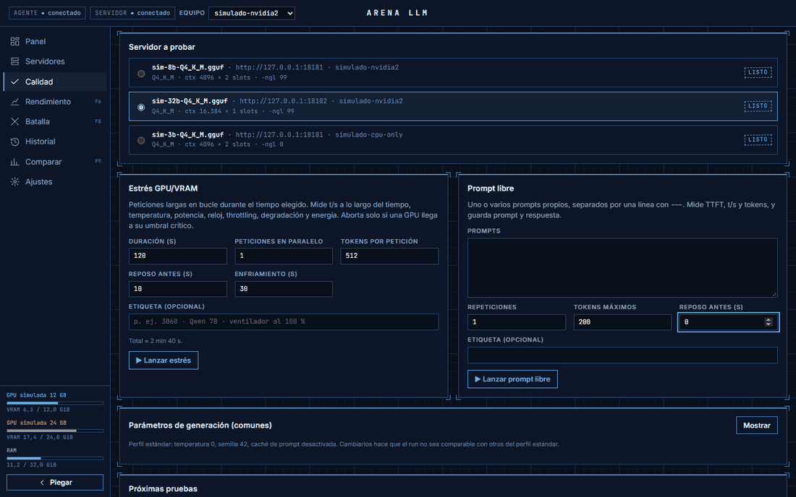

La **biblioteca** trae 28 prompts en 7 categorías: lógica, tipo test de CI, matemáticas, código, seguir instrucciones, redacción y explicar. Se añaden con un clic, uno a uno o por categorías. Los que tienen respuesta objetiva llevan `ref`, y en el run se ve la **respuesta de referencia** junto a la del modelo.

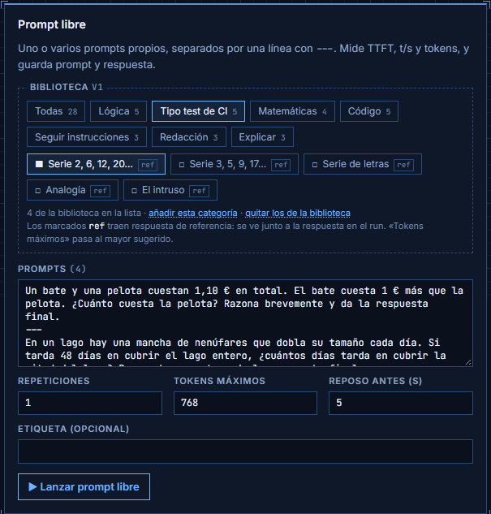

La biblioteca es un fichero de datos ([`server/catalog/prompts.json`](server/catalog/prompts.json)). Para añadir los tuyos sin tocar el repositorio, crea un `prompts.json` con la misma forma en la carpeta de datos (`data/` o `ARENA_DATA_DIR`). Un `id` repetido sustituye al de la base.

### Rendimiento por componente (`llama-bench`)

La página **Rendimiento** lanza `llama-bench` desde el agente con un perfil estándar (pp512, tg128, 3 repeticiones). Hay cuatro pruebas:

- **Un dispositivo**.
- **Solo CPU/RAM**, con barrido de hilos.
- **Curva `-ngl`**: t/s según cuántas capas van en la GPU.
- **Reparto `-ts`** entre GPU.

El run muestra la curva, una tabla con el % de capas en GPU y el ancho de banda efectivo (`ESTIMADO`), con la telemetría y el aborto térmico de siempre. El agente solo ejecuta el `llama-bench` de su configuración, con una lista cerrada de flags.

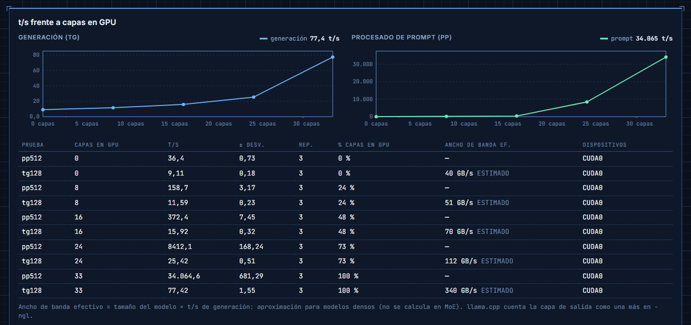

### Historial

Todos los runs guardados, con su servidor, modelo, suite (versión y hash) y métricas principales.

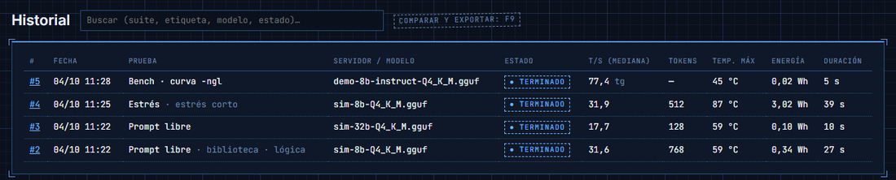

### Ajustes

Apariencia (color de acento, contraste, tamaño de la interfaz, rejilla y efecto croquis), equipos, umbrales térmicos por dispositivo y datos.

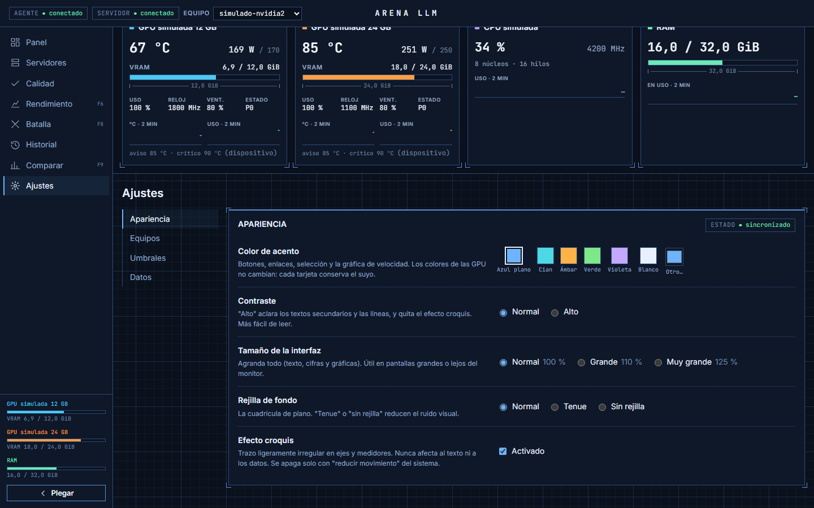

## Principios

- **Independiente del hardware.** Nada cableado: ni nombres de GPU, ni puertos, ni rutas, ni VRAM, ni umbrales. Todo se autodetecta o se configura. Los proveedores de telemetría son enchufables (v1: NVIDIA y CPU/RAM; un equipo solo con CPU también funciona).
- **Detecta, no controla.** Tú lanzas `llama-server` como siempre (Arena te propone el comando) y Arena lo detecta y guarda su configuración. Arrancar y parar servidores desde la web está en el backlog. La única excepción es `llama-bench`, que lanza el agente.
- **No inventa datos.** Lo que no se puede medir sale como "sin datos", nunca como 0. Las estimaciones (encaje, comando propuesto, ancho de banda, potencia de placa…) llevan el sello `ESTIMADO`.
- **Reproducible y comparable.** Cada prueba tiene versión y hash. El perfil estándar fija semilla, temperatura 0 y `cache_prompt` desactivado, y cada run guarda su foto de configuración completa.

## Componentes

| Carpeta | Qué es | Requisitos |
|---|---|---|
| `agent/` | Agente por equipo: telemetría (GPU, CPU, RAM), detección de `llama-server`, cabeceras GGUF y `llama-bench` | Python 3.11+, **solo biblioteca estándar** (+ `nvidia-smi` si hay GPU NVIDIA) |
| `server/` | API, sondeo de agentes, eventos en vivo (SSE), runner de pruebas, calculadora y base de datos SQLite | Python 3.11+, FastAPI, uvicorn, httpx |
| `web/` | Interfaz en Vue 3 + Vite + TypeScript, con gráficas propias en SVG | Node 20+ (solo para compilarla) |

## Puesta en marcha

### 1. Instalar (una vez)

```bat
scripts\setup.bat          :: crea .venv (Python 3.12 por defecto; scripts\setup.bat 3.11 para otra versión)
scripts\build-web.bat      :: compila la web en web\dist (repetir tras cambios en web\)
```

### 2. Configurar el agente (una vez por equipo)

Crea `%APPDATA%\ArenaLLM\agent.json` en Windows, o `~/.config/arena-llm/agent.json` en Linux:

```json
{
  "model_dirs": ["D:/modelos"],
  "llama_bench": "D:/llama.cpp/llama-bench.exe",
  "llama_server": "D:/llama.cpp/llama-server.exe"
}
```

- `model_dirs`: carpetas cuyos GGUF puede leer el agente (calculadora y `llama-bench`). Sin esta clave, el agente funciona pero no lee GGUF.
- `llama_bench`: para la página Rendimiento.
- `llama_server`: opcional. Si falta, se usa el `llama-server` que haya junto a `llama-bench`. Solo sirve para proponer el comando; el agente nunca lo ejecuta.

La configuración se busca, por este orden, en `--config <fichero>`, en la variable `ARENA_AGENT_CONFIG` y en la ruta de arriba.

### 3. Uso normal

```bat
scripts\start-agent.bat    :: agente en 127.0.0.1:9100 (déjalo abierto)
scripts\start-server.bat --agent http://127.0.0.1:9100    :: servidor en http://127.0.0.1:8090
```

Abre `http://127.0.0.1:8090`. Después:

1. **Servidores → GGUF en disco**: elige contexto y slots, mira si el modelo cabe y pulsa **Ver comando**.
2. Copia el comando y ejecútalo en una terminal. Arena detecta el servidor en unos 5 s, y cuando aparece como **listo** ya se puede probar.
3. **Calidad**: elige el servidor y lanza **Prompt libre** (con prompts de la biblioteca) o **Estrés**.
4. **Rendimiento**: `llama-bench` por componente, sin necesidad de tener un `llama-server` cargado. Es mejor que no lo haya, porque ocupa la tarjeta.
5. **Historial**: todos los runs. Desde cada run se ve el resultado completo.

`scripts\stop.bat` para todo lo de Arena, pero no toca los `llama-server` que hayas lanzado tú. En Linux, los mismos scripts terminan en `.sh`.

### Demo sin GPU

```bat
scripts\demo.bat D:\modelos    :: agente real + agente simulado (2 GPU, 2 llama-server simulados) + servidor, y abre el navegador
```

### Por piezas

```bash
# Agente (cada equipo con GPU). Solo escucha en localhost salvo que haya token.
python -m agent --port 9100 --models-dir D:/modelos --llama-bench D:/llama.cpp/llama-bench.exe
python -m agent --simulate nvidia2        # perfiles: nvidia2 | cpu-only | partial
ARENA_AGENT_TOKEN=... python -m agent --host 0.0.0.0   # fuera de localhost exige token

# Servidor (puerto 8090; el 8080 lo usa llama-server)
python -m server --agent http://127.0.0.1:9100 [--port 8090] [--data-dir <carpeta>]

# llama-server simulado (sin GPU), para desarrollar o probar
python -m server.fakes.fake_llama --port 18081 --tps 40

# Web en desarrollo con recarga en caliente (necesita el servidor en marcha)
npm run dev --prefix web

# Tests
pytest && npm test --prefix web
```

En Windows, `python` es el de `.venv\Scripts\python.exe` (los scripts `.bat` ya lo usan).

## Estado por fases

| Fase | Qué | Estado |
|---|---|---|
| F1 | Esqueleto y agente (telemetría, detección, perfiles simulados) | ✅ |
| F2 | GUI base y plano del equipo | ✅ |
| F3 | Servidores, modelos y detección (calculadora de encaje, comando de arranque, alta manual) | Casi: falta un criterio con un servidor real |
| F4 | Runner núcleo (prompt libre y biblioteca de prompts) | ✅ |
| F5 | Telemetría sincronizada, resumen y estrés | ✅ salvo la prueba real de 5 min |
| F6 | Rendimiento por componente (`llama-bench`) | ✅ (reparto `-ts` probado solo en simulado) |
| — | Recomendaciones de modelos según el hardware | Siguiente |
| F7 | Pruebas de calidad (razonamiento, código aislado, contexto largo, concurrencia) | Pendiente |
| F8 | Batalla: el mismo prompt en dos o más lados | Pendiente |
| F9 | Historial, comparación (insignia de comparabilidad) y exportación | Pendiente |
| F10–F12 | Modo vídeo, despliegue en Linux y backlog | Pendiente |

## Datos

La base de datos vive en `data/` o en la ruta de `ARENA_DATA_DIR`. `data/` está excluida de git y de Syncthing, y los datos nunca se suben al repositorio.

## Documentación

- [`docs/HOJA-DE-RUTA.md`](docs/HOJA-DE-RUTA.md): decisiones y fases.
- [`docs/PLAN-CONSTRUCCION.md`](docs/PLAN-CONSTRUCCION.md): módulos, contrato entre agente y servidor, e hitos.
- [`docs/GUI-DISENO.md`](docs/GUI-DISENO.md): interfaz.
- [`docs/VIABILIDAD.md`](docs/VIABILIDAD.md): riesgos, métricas y datasets de pruebas.
