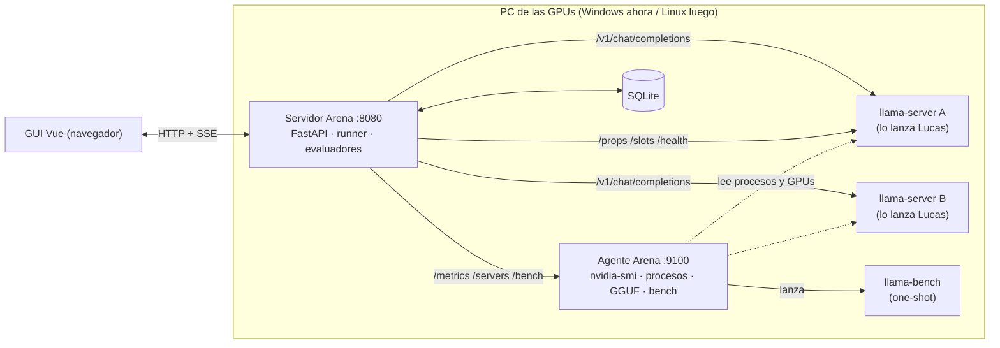

# Arena LLM — Hoja de ruta v2 (final)

> 03/10/2026 · Sustituye a las fases del estudio inicial ([[03 - PROYECTOS TEC/Arena LLM/docs/VIABILIDAD|VIABILIDAD]]).
> Diseño de la interfaz: [[03 - PROYECTOS TEC/Arena LLM/docs/GUI-DISENO|GUI-DISENO]]. Reglas de trabajo: `CLAUDE.md` de esta carpeta.

---

## 0. Cómo leer esto (para Claude Code)

1. Lee `CLAUDE.md`, este documento entero y `GUI-DISENO.md`. De `VIABILIDAD.md` lee §2 (riesgos), §6 (métricas) y §7 (datasets de pruebas).
2. Trabaja **una fase cada vez**, en orden. No empieces una fase sin cumplir los criterios de la anterior.
3. Si algo choca con la realidad del hardware (campo de `nvidia-smi` ausente, flag de llama.cpp distinto en tu build…), **para y pregunta**; no inventes.
4. Al acabar cada fase: actualiza `ESTADO.md` del repo y añade una línea a `log.md` del vault (formato en el `CLAUDE.md` del vault).

---

## 1. Qué es Arena LLM

Una web local para **medir, enfrentar y comparar modelos de IA locales** (llama.cpp) en las GPUs y la RAM del PC de Lucas, con la telemetría del equipo siempre visible. Sirve para decidir qué modelo usar y para fabricar contenido de vídeo (Impuls 16).

**Tres cosas que tiene que hacer bien, por este orden:**

1. **Mostrar siempre el estado del equipo** (cada GPU, CPU, RAM) para ver de un vistazo que no pasa nada raro.
2. **Detectar solo** qué modelo, contexto y flags tiene cada `llama-server` y guardarlo con cada prueba.
3. **Probar y comparar**: pruebas de rendimiento por componente, pruebas de calidad, batallas A vs B y comparación de cualquier resultado guardado.

### Principio rector: independiente del hardware (decidido 03/10/2026)

Arena **no está ligado al PC de Lucas**. Debe valer para hacer **benchmarks idénticos entre dispositivos y tarjetas distintas** (este PC con la 3060 y la M40, otro PC, un servidor, otro año con otras tarjetas…). Consecuencias obligatorias:

1. **Nada cableado.** Prohibido escribir en el código nombres de GPU, índices, puertos, rutas, cantidades de VRAM/RAM, umbrales de temperatura o modelos concretos. Todo se **autodetecta** o se **configura** (y la configuración se guarda).
2. **Registro de equipos y dispositivos.** Cada máquina (`host`) y cada dispositivo (GPU/CPU) detectado se registra con su ficha (fabricante, nombre, UUID, memoria, límites, driver). Los runs apuntan a esa ficha.
3. **Proveedores de telemetría enchufables.** Una interfaz común (`temperatura, potencia, VRAM, util, relojes, throttling…`) con un proveedor por fabricante. **v1: NVIDIA (`nvidia-smi`) + CPU/RAM.** AMD (`rocm-smi`/`amd-smi`), Intel y Apple quedan como proveedores futuros que no exigen tocar el resto. Un equipo **solo con CPU** también funciona.
4. **Motores enchufables.** v1: llama.cpp (`llama-server`, `llama-bench`). La capa del cliente habla con cualquier endpoint compatible con OpenAI; las métricas propias de llama.cpp son opcionales.
5. **Umbrales derivados del dispositivo.** El aviso y el aborto térmicos se calculan a partir de la temperatura de *slowdown* que reporta cada GPU (con valores por defecto por fabricante si no la reporta) y el usuario puede cambiarlos por dispositivo.
6. **Benchmarks reproducibles y comparables entre equipos.** Cada prueba tiene una **versión y un hash** de su contenido (prompts, semillas, datasets, parámetros por defecto). El **perfil estándar** fija semilla, temperatura 0, `cache_prompt` desactivado y los mismos prompts en cualquier máquina. Los modelos se identifican por **tamaño + hash de la cabecera del GGUF** (y SHA-256 completo calculado en segundo plano).
7. **Insignia de comparabilidad.** Al comparar runs, Arena indica si son **Comparables**, **Parcialmente comparables** o **No comparables**, y por qué (distinto modelo/cuantización, otra versión de la prueba, otro contexto, otra build de llama.cpp, otros parámetros…).
8. **Paquetes de resultados.** Exportar/importar runs como un fichero (JSON con su ficha de equipo y versión de prueba) para comparar resultados entre instalaciones distintas.
9. **Tests con perfiles de hardware simulados.** La suite de tests incluye al menos tres equipos falsos (varias GPU NVIDIA, solo CPU, GPU sin ciertos campos) para demostrar que nada depende de la máquina de Lucas.

---

## 2. Decisiones cerradas

| Tema | Decisión | Fecha |
|---|---|---|
| Motor | llama.cpp. Varias instancias de `llama-server` (una por GPU/modelo) y `llama-bench` | 03/10/2026 |
| **Portabilidad** | **Arena es independiente del hardware**: autodetecta equipos y dispositivos y compara benchmarks idénticos entre máquinas y tarjetas (ver "Principio rector" en §1) | 03/10/2026 |
| Entorno de partida (ejemplo, no dependencia) | RTX 3060 12 GB + Tesla M40 **24 GB** (comprada, pendiente de llegar) + Ryzen 5 3600 · fuente 750 W y ventilador ya comprados | 03/10/2026 |
| Telemetría | Proveedores enchufables; v1 NVIDIA (`nvidia-smi`) + CPU/RAM; AMD/Intel/Apple después | 03/10/2026 |
| Sistema | Windows ahora, Linux (dual boot) más adelante; todo debe funcionar en ambos | 03/10/2026 |
| Dónde corre | Primero **todo en el PC de las GPUs** (servidor + agente + web en `localhost`). Mover el servidor a Proxmox es la Fase 11 | 03/10/2026 |
| **Control** | **La GUI detecta, no controla.** Lucas lanza `llama-server` como siempre (scripts o la interfaz de llama.cpp). Arena detecta el modelo, el contexto y los flags y lo guarda. Arrancar/parar servidores desde la web queda en el backlog | 03/10/2026 |
| Barridos | Con "modo guiado": Arena indica qué configuración toca, espera a que Lucas relance el servidor, **detecta el cambio** y ejecuta. Sin necesidad de controlar procesos | 03/10/2026 |
| Rendimiento por componente | Se hace con **`llama-bench`** lanzado por el agente (un solo uso, con lista de flags permitidos) | 03/10/2026 |
| Backend | Python 3.11+, FastAPI, httpx, SQLite (stdlib) | 03/10/2026 |
| Agente | Un script Python **solo con biblioteca estándar** + `nvidia-smi`, para correr en cualquier PC sin instalar paquetes | 03/10/2026 |
| Frontend | **Vue 3 + Vite + TypeScript**, gráficas propias en **SVG** (para el estilo blueprint). Sin CDN en producción; fuentes y librerías vendorizadas | 03/10/2026 |
| Estilo | Oscuro, tipo consola de laboratorio con estética **blueprint/sketch**. Referencia estructural: FreeToken Desktop (no copiar). Ver `GUI-DISENO.md` | 03/10/2026 |
| Idioma | Interfaz y baterías de pruebas en español; inglés más adelante | 03/10/2026 |
| Seguridad térmica | Aviso y **aborto automático derivados de la temperatura de *slowdown* de cada dispositivo**, editables por dispositivo. Valores de partida para la M40 de Lucas: aviso 80 °C, aborto 85 °C | 03/10/2026 |
| Ubicación | Código en `03 - PROYECTOS TEC/Arena LLM/` con repo git propio. **Entorno virtual, `node_modules`, builds y base de datos fuera de la sincronización** (ver §3) | 03/10/2026 |

---

## 3. Entorno de partida de Lucas (ejemplo) y avisos

> Esta sección describe **el primer equipo en el que se probará Arena**, no una dependencia. Arena lo tratará como un `host` más, detectado automáticamente. Sirve para planificar la Fase 0 y los avisos de este PC.

| Elemento | Dato | Aviso |
|---|---|---|
| CPU | AMD Ryzen 5 3600 (6 núcleos / 12 hilos) | Visible en la captura de FreeToken |
| GPU 1 | RTX 3060 12 GB | Mueve la pantalla: pierde ~1 GB de VRAM útil |
| GPU 2 | Tesla M40 24 GB (Maxwell, compute 5.2) | Pasiva (ventilador propio), sin salida de vídeo, EPS 8 pines, CUDA 12.x, driver rama 580 |
| Fuente | 750 W | Justa en picos: M40 250 W + 3060 170 W + CPU. Plan: limitar potencia de la M40 si hace falta |
| **RAM** | ⚠️ **La captura de FreeToken muestra 15,9 GiB (11,8 GiB ya usados en reposo)** | Lucas habló de 32 GB. **Comprobar en Fase 0** (módulos, XMP, ranuras). Si son 16 GB, el techo de modelos grandes baja mucho (ver abajo) |
| Disco | `C:` con poco espacio | Instalar Python, Node, entornos y modelos GGUF en `D:` (como se hizo con Rust en `D:\dev-tools\`) |

**Qué cambia según la RAM** (estimaciones, a confirmar en Fase 0):

| RAM real | Modelos grandes viables |
|---|---|
| 32 GB | 70B en Q3 repartido entre las dos GPUs (~34 GB) y 70B Q4 con ~8 GB en RAM (lento). MoE de hasta ~100B con expertos en RAM |
| 16 GB | Solo lo que cabe en ~34 GB de VRAM útil (70B Q3 muy justo, sin contexto largo) y MoE medianos. 70B Q4 descartado |

Ninguno de estos números cambia el diseño de Arena; solo el catálogo de pruebas "estrella".

**Sincronización del vault.** El vault usa Syncthing (hay un `log.sync-conflict-…`). Dentro de `Arena LLM/` habrá un `.stignore` con `.venv`, `node_modules`, `dist`, `data` y `*.db*`. Una base de datos SQLite sincronizada en vivo se puede corromper: **la BD vive en `data/` (ignorada)** o, mejor, fuera del vault con la variable `ARENA_DATA_DIR`.

---

## 4. Arquitectura

- El agente escucha en `127.0.0.1` por defecto. Si se expone a la red, **exige token**.
- El agente **no es una shell remota**: solo ejecuta `llama-bench` con una lista cerrada de flags y rutas permitidas por su fichero de configuración local.
- Mover el servidor a Proxmox (Fase 11) solo cambia las URLs de los endpoints.

---

## 5. Detección de configuración (la pieza clave)

Objetivo: que cada prueba guarde **sola** el modelo, el contexto y los flags, sin que Lucas los teclee.

| Fuente | Qué da | Notas |
|---|---|---|
| `GET /props` de llama-server | Ruta/alias del modelo, `n_ctx`, nº de *slots*, plantilla de chat, parámetros por defecto, versión de la build | Los nombres de campo cambian entre versiones: **parsear con tolerancia** y guardar el JSON completo |
| `GET /slots`, `GET /health`, `GET /v1/models` | Contexto por slot, estado, modelo cargado | `/slots` puede estar desactivado según flags |
| **Agente `/servers`** | Procesos `llama-server` en marcha con su **línea de comandos** → `-m`, `-ngl`, `-c`, `-ts`, `--parallel`, `-fa`, `-b/-ub`, `--cache-type-k/v`, `-t`, `--port`, offload de tensores/MoE… | Windows: PowerShell `Get-CimInstance Win32_Process`; Linux: `/proc/<pid>/cmdline`. Las variables de entorno (p. ej. `CUDA_VISIBLE_DEVICES`) **no** salen de la línea de comandos en Windows |
| `nvidia-smi --query-compute-apps` | Qué proceso usa qué GPU y cuánta VRAM | En Windows con modo WDDM puede devolver N/A por proceso → **plan B:** asociar endpoint↔GPU por el **aumento de VRAM** al cargar, o por configuración manual |
| **Cabecera del GGUF** (lo lee el agente) | Arquitectura, nº de capas, cabezas KV, longitud de contexto de entrenamiento, cuantización, tamaño | Permite **estimar el KV cache y el encaje** antes de lanzar nada |

**Resultado:** cada `run` guarda un `servers_snapshot` (todo lo anterior) y el comparador resalta qué cambió entre dos runs.

**Calculadora de encaje** (página Modelos): para cada GGUF de la carpeta de modelos (configurable) calcula `pesos + KV(c) + margen` frente a VRAM libre de cada GPU y RAM libre, y muestra: *cabe en 3060 · cabe en M40 · cabe repartido · necesita X GiB de RAM · no cabe*. Los avisos van como etiquetas (como hace FreeToken con "Insufficient VRAM/RAM"). Son **estimaciones**, y así se rotulan.

---

## 6. Familias de pruebas

| Familia | Qué responde | Cómo se ejecuta |
|---|---|---|
| **Rendimiento · solo GPU** | ¿Cuánto da una tarjeta sola? (pp/tg a distintos tamaños) | `llama-bench` con una única GPU visible, `-ngl` máximo |
| **Rendimiento · solo CPU/RAM** | ¿Qué da la CPU con la RAM? Barrido de hilos | `llama-bench` con `-ngl 0` y `-t` variable |
| **Rendimiento · híbrido (la curva de la RAM)** | ¿Cuánto se pierde por cada capa que pasa a RAM? | `llama-bench` con barrido de `-ngl` |
| **Rendimiento · reparto entre GPUs** | ¿Cómo reparto un modelo grande entre 3060 y M40? | `llama-bench` con barrido de `-ts` |
| **Estrés** | Térmica, throttling, degradación, energía | Servidor, bucle largo, paralelo configurable |
| **Contexto largo** | Velocidad de prompt y VRAM vs contexto; aguja en pajar | Servidor |
| **Concurrencia** | t/s por petición y agregado con N peticiones | Servidor (`--parallel ≥ N`) |
| **Calidad · razonamiento** | % de aciertos | Servidor + evaluador |
| **Calidad · código** | pass@1 con ejecución aislada | Servidor + sandbox |
| **Libre** | Prompt propio para demos | Servidor |
| **Batalla** | Mismo prompt/prueba en 2+ lados con parámetros distintos | Servidor, en paralelo o secuencial |

Datasets, aserciones y semillas: ver `VIABILIDAD.md` §7 (12 preguntas de razonamiento, 10 problemas de código, aguja en pajar, etc.).

### Métricas nuevas respecto al estudio inicial

| Métrica | Cómo se calcula | Uso |
|---|---|---|
| **Ancho de banda efectivo** | `tamaño_del_modelo × t/s de generación` (aprox., modelos densos) | Compara cada GPU y la RAM con su ancho de banda teórico: ¿cuánto del máximo se aprovecha? |
| **% de capas en GPU / en RAM** | `-ngl` frente a nº de capas del GGUF | Eje X de la curva de la RAM |
| **Desborde a RAM (GiB)** | pesos + KV − VRAM disponible | Aviso previo y etiqueta del run |
| **Eficiencia energética** | tokens/Wh | Ranking entre tarjetas |
| **Cambios de configuración** | diff de `servers_snapshot` | Comparar runs con sentido |

Fórmulas y avisos están en `VIABILIDAD.md` §6; el ancho de banda efectivo es una **aproximación** y la UI debe rotularla así.

### Modo guiado de barridos

1. Lucas elige la prueba y la variable (p. ej. `-ngl`: 0, 10, 20, 30, 40, máx).
2. Arena muestra la **configuración exacta que toca** (una línea de comandos copiable).
3. Lucas relanza el `llama-server`; Arena **detecta el cambio** (§5) y comprueba que coincide con lo pedido.
4. Se ejecuta la prueba y se pasa al siguiente punto. Si no coincide, avisa en vez de guardar datos falsos.
5. Los `llama-bench` de rendimiento por componente **no necesitan esto**: el agente los lanza y cambia los flags él mismo.

---

## 7. Modelo de datos (ampliación sobre `VIABILIDAD.md` §5)

- `runs.kind`: `bench` | `quality` | `stress` | `battle-side` | `free`.
- `runs.servers_snapshot` (JSON): detección completa de §5. Sustituye a `target_snapshot`, que pasa a ser un subconjunto.
- `bench_rows`: `run_id, test (pp/tg), n_tokens, params (JSON), t_s_mean, t_s_std, reps`.
- `hosts`: máquina (id, nombre, SO, CPU, RAM, versión del agente, URL del agente, última vez visto).
- `devices`: dispositivo detectado (host, proveedor, tipo `gpu`/`cpu`, nombre, UUID, memoria, límites de potencia y temperatura, driver, capacidades). El color en la GUI se asigna y guarda por UUID.
- `suite_versions`: prueba, versión, **hash del contenido** (prompts, semillas, datasets, parámetros por defecto). Cada run guarda la versión y el hash.
- `models`: identificación estable de un modelo (nombre, cuantización, tamaño, **hash de cabecera GGUF**, SHA-256 completo cuando esté calculado).
- `runs` apunta a `host`, `device(s)`, `suite_version` y `model`, y guarda un `comparability_key` para decidir si dos runs son comparables.
- `settings`: umbrales de temperatura por dispositivo (si el usuario los cambia), carpeta de modelos, rutas permitidas del agente, intervalo de muestreo.
- Todo run guarda **su foto de configuración** (regla de oro): nunca interpretar un resultado viejo con ajustes actuales.

---

## 8. Fases

> Convención: cada fase termina con criterios de aceptación comprobables y un commit por hito (`feat:`, `fix:`, `chore:`, en español). Probar sin GPU con un `llama-server` simulado y un agente en modo simulado.

### F0 — Preparación del primer equipo (Lucas + Claude; sin código del proyecto)
- [ ] Comprobar la **RAM real** (16 o 32 GB) y activar el perfil XMP.
- [ ] Instalar en `D:`: Python 3.11+, Node 20+, git. Anotar rutas.
- [ ] Llega la M40: instalar con ventilador y EPS; BIOS con *Above 4G decoding*; ambas visibles en `nvidia-smi`; anotar driver, modo (WDDM/TCC) e índices.
- [ ] Build de llama.cpp con CUDA 12.x que soporte Maxwell; `llama-bench` en cada tarjeta con un modelo pequeño y comparar con la referencia de la M40 (~283 / ~38 t/s con Llama 2 7B Q4_0).
- [ ] Dos `llama-server` (puertos 8081/8082) con `CUDA_DEVICE_ORDER=PCI_BUS_ID`; comprobar qué GPU ocupa cada uno.
- [ ] Prueba térmica de 5 minutos en la M40 (¿aguanta por debajo de 85 °C?).
- [ ] Verificar: `/props`, `/slots`, `timings` en el streaming, y qué devuelve `nvidia-smi --query-compute-apps` en tu driver.
**Entregable:** nota con driver, build, flags y resultados (primera ficha de referencia).

### F1 — Esqueleto y agente
- [x] Repo con `agent/`, `server/`, `web/`, `tests/`, `docs/`, `.gitignore`, `.stignore`, `README`, `ESTADO.md`, scripts `.bat`/`.sh`.
- [x] Agente (solo stdlib): `/health`, `/info`, `/metrics` (por GPU: temp, potencia, límite, util, VRAM, relojes, fan, pstate, throttle, PCIe; CPU y RAM), `/servers` (detección §5), `/gguf` (cabecera).
- [x] Campos no soportados → `null`; campo inválido en el driver → se descarta y se reintenta; decodificación de *throttle reasons* con tests.
- [x] **Capa de proveedores de telemetría** con una interfaz común; implementar NVIDIA y CPU/RAM; un proveedor "nulo" para equipos sin GPU. Añadir otro fabricante no debe tocar el resto del código.
- [x] `/info` devuelve una **ficha de equipo normalizada** (host + lista de dispositivos con proveedor, tipo, nombre, UUID, memoria, límites, driver).
- [x] Modo simulado con **tres perfiles de hardware falsos** (2 GPU NVIDIA, solo CPU, GPU con campos ausentes) para desarrollar sin hardware y probar que nada depende de este PC.
**Criterio:** en el PC real devuelve datos de todas las GPUs presentes y detecta un `llama-server` en marcha con su línea de comandos; con cada perfil simulado la API devuelve datos coherentes y la suite de tests pasa.  
  *Estado 03/10/2026: cumplido con la RTX 3060 y los tres perfiles simulados (108 tests). Pendiente: detectar un `llama-server` real (falta instalar llama.cpp).*

### F2 — GUI base y "plano del equipo"
- [x] Vue 3 + Vite + TS; tokens de diseño blueprint; fuentes vendorizadas.
- [ ] Estructura de FreeToken como referencia: barra superior con chips de estado, menú lateral colapsable con el pie de VRAM/RAM, tarjetas, ajustes con subnavegación. *(03/10/2026: hecho salvo Ajustes con subnavegación, que llega con F3)*
- [x] **Franja del equipo siempre visible**: una tarjeta por GPU (temp, W, VRAM con barra, reloj, aviso de throttling), CPU y RAM; actualización cada 1 s por SSE.
- [x] Página **Panel** (equivalente a la Console de FreeToken) con medidores radiales y estado de servidores detectados.
**Criterio:** con el agente real, los medidores se mueven en vivo; con el agente caído, la GUI lo indica sin romperse.  
  *Estado 03/10/2026: cumplido (agente real y simulado; agente caído → chip "sin respuesta", datos atenuados con sello SIN DATOS y último dato).*

### F3 — Servidores, modelos y detección
- [x] **Varios equipos (`hosts`)**: registrar agentes de distintas máquinas y cambiar de equipo en la GUI. Autodescubrimiento opcional en la red local. *(03/10/2026: registro de agentes y selector de equipo; sin autodescubrimiento en red)*
- [x] CRUD de endpoints (URL del `llama-server`, URL del agente, dispositivo asociado, alias). Botón **Detectar** (§5). *(03/10/2026: alta manual con equipo, URL, alias y GPU; se sondea cada 5 s aunque el agente no vea el proceso; GPU asignable a mano en cualquier servidor; baja de manuales y detenidos)*
- [x] Página **Modelos/Servidores**: tarjeta por servidor detectado con modelo, cuantización, contexto, `-ngl`, `-ts`, slots, KV, flags, GPU y VRAM que ocupa.
- [x] Carpeta de modelos configurable: lista de GGUF con **calculadora de encaje**. *(03/10/2026: pestaña GGUF en disco en Servidores; pesos reales por capa, KV solo en capas de atención en híbridos, estado recurrente, `-ngl` sugerido; verificada con los 4 GGUF de Lucas)*
- [x] Cada cambio de configuración detectado queda registrado con fecha.
**Criterio:** relanzar un servidor con otro `-c` o `-ngl` se refleja en la GUI en menos de 10 s sin tocar nada.  
  *Estado 03/10/2026: detección cada 5 s; un cambio de contexto se registra con su diff (probado con llama-server simulado). Falta probarlo relanzando el real.*

### F4 — Runner núcleo (prompt libre)
- [x] Streaming contra `/v1/chat/completions`; TTFT, t/s (servidor y cliente), tokens, `reasoning_content` aparte; guardar prompt, respuesta, métricas y `servers_snapshot`.
- [x] Errores (contexto excedido, endpoint caído, VRAM insuficiente) se guardan como resultado.
- [x] Pantalla de ejecución en vivo y detalle de un run.
**Criterio:** un prompt real guarda un run completo con t/s coherente con `llama-bench` (±15 %).  
  *Cumplido 03/10/2026: RTX 3060 · Qwen2.5-Coder 7B Q8 · b11379 → Arena 33,6 t/s (mediana, cliente = servidor) frente a llama-bench tg128 34,5 ± 0,7 (−2,7 %).*

### F5 — Telemetría sincronizada, resumen y estrés
- [x] Muestreo durante el run: línea base → carga → enfriamiento opcional; `samples` y `tps_series`.
- [x] Resumen: energía (Wh), tokens/Wh, % throttling, degradación (primer 20 % vs último 20 %), VRAM pico, estadísticas de t/s.
- [x] Suite **estrés** (duración, paralelo, tokens por petición) con gráfica en vivo.
- [x] **Aborto automático** por temperatura con umbrales **derivados de cada dispositivo** (temperatura de *slowdown* que reporta; valores por defecto por fabricante si no la reporta) y editables; registro del motivo.
**Criterio:** una prueba de 5 min en cualquier GPU produce curva de t/s y temperatura; superar el umbral aborta y lo deja anotado.  
  *Estado 03/10/2026: estrés real de 60 s en la 3060 con curvas de t/s, °C, W y reloj; aborto probado con umbral bajo en el laboratorio simulado. Falta la prueba de 5 min real (y la M40).*

### F6 — Rendimiento por componente (`llama-bench`)
- [x] El agente ejecuta `llama-bench` con lista cerrada de flags y rutas; devuelve JSON; el servidor lo guarda en `bench_rows` con telemetría.
- [x] Pruebas: **solo un dispositivo** (cualquier GPU detectada), **solo CPU/RAM** (barrido de hilos), **híbrido** (barrido de `-ngl`), **reparto** entre GPUs (`-ts`). El selector lista los dispositivos **detectados**, no una lista fija.
- [x] **Perfil estándar de benchmark** (mismos tamaños de prompt/generación, repeticiones y semilla en cualquier equipo) con versión y hash.
- [x] Comprobación previa de VRAM libre; negarse a lanzar si hay un servidor ocupando la tarjeta (o avisar).
- [x] Métricas derivadas: ancho de banda efectivo y % de capas en GPU.
**Criterio:** la curva t/s frente a capas en GPU de un mismo modelo se dibuja y se puede guardar.
  *Cumplido 03/10/2026: RTX 3060 · Qwen2.5-Coder 7B Q8 · b11379 → tg 3,2 / 3,6 / 4,4 / 8,8 / 38,7 t/s con 0 / 7 / 14 / 22 / 29 capas (run guardado). El reparto `-ts` solo se ha probado con el agente simulado (falta la M40).*

### Ideas de Lucas (03/10/2026) — para después de F6
- [x] **Biblioteca de prompts predefinidos** en Prompt libre: problemas de lógica, acertijos tipo test de CI, matemáticas, código, redacción… elegibles con un clic (encaja con los datasets de F7).
  *Hecho 04/10/2026: 28 prompts en 7 categorías en `server/catalog/prompts.json` (datos, no código), ampliable con `prompts.json` en la carpeta de datos; respuesta de referencia visible en el run.*
- [ ] **Comando copiable de `llama-server`** para cada GGUF desde la calculadora de encaje (ruta del binario detectada, `-m`, `-ngl` sugerido, `-c`, `-ts`, `--port` libre, `-fa`). Es también el paso 2 del modo guiado de F8.
- [ ] **Recomendaciones de modelos según el hardware**: qué tamaño y cuantización caben en cada equipo (por VRAM + RAM y ancho de banda medido en F6), con un catálogo editable de modelos conocidos (fichero de datos, no código).

### F7 — Pruebas de calidad
- [ ] `qa` (12 preguntas), `contexto` (aguja en pajar + VRAM vs contexto), `concurrencia`, `codigo` (10 problemas con ejecución aislada), todas con opciones editables y semillas fijas.
- [ ] Sandbox del código: subproceso, timeout, sin stdin, directorio temporal, sin red.
**Criterio:** mismas semillas ⇒ mismos prompts; un código con bucle infinito o escritura de ficheros no bloquea ni daña el servidor.

### F8 — Batalla
- [ ] 2+ lados (paralelo o secuencial) con parámetros editables por lado (muestreo, `max_tokens`, `cache_prompt`, `extra` JSON, prompt de sistema), copia A→B y "variar solo un parámetro".
- [ ] Vista en columnas con respuesta en streaming, números grandes y mini-gráficas; marcador final.
- [ ] **Modo guiado** de barridos (§6).
**Criterio:** dos lados simultáneos en M40 y 3060, telemetría separada por GPU, prompts y semillas idénticos verificados por test.

### F9 — Historial, comparación y exportación
- [ ] Historial filtrable con etiquetas/notas; bandeja "Comparar (N)".
- [ ] Comparador: tarjetas de veredicto, tabla con mejor valor resaltado, gráficas superpuestas, matriz por ítem, diff de configuración.
- [ ] Exportar JSON, CSV, **Markdown para el vault** (con YAML válido) e imagen del marcador.
- [ ] **Comparación entre equipos y tarjetas:** insignia de comparabilidad (Comparables / Parcialmente / No comparables, con los motivos), métricas normalizadas opcionales (t/s por GiB de VRAM, por W, por Wh) y filtro por equipo/dispositivo.
- [ ] **Paquete de resultados**: exportar e importar runs (con ficha de equipo, versión de prueba y modelo) para comparar entre instalaciones.
**Criterio:** comparar 5+ runs de al menos dos equipos o dispositivos distintos; el Markdown exportado se pega en el vault sin errores; un run de otra versión de prueba se marca como no comparable.

### F10 — Modo vídeo y pulido
- [ ] Modo vídeo (menú oculto, fuentes grandes, 16:9, marcador exportable).
- [ ] Accesibilidad mínima: `prefers-reduced-motion` (desactiva el efecto "sketch" y animaciones), foco visible, contraste AA, no depender solo del color.
- [ ] Documentación de uso y de cómo añadir una GPU o un endpoint.

### F11 — Despliegue y Linux
- [ ] Servidor en Proxmox (LXC/Docker) hablando con el agente del PC; agente como servicio (Windows y Linux); token obligatorio fuera de `localhost`.
- [ ] Copia de seguridad de la BD; comprobación tras el **dual boot a Linux**.

### F12 — Backlog
Arrancar/parar `llama-server` desde la web · votación humana ciega con Elo · LLM-juez · medidor de potencia real (enchufe) · otros motores y GPUs · puntuación única "ArenaScore" · inglés.

---

## 9. Riesgos vivos (resumen; detalle en `VIABILIDAD.md` §2)

| Riesgo | Mitigación |
|---|---|
| RAM real distinta de 32 GB | Verificar en F0; el catálogo "estrella" se ajusta |
| M40 pasiva y térmica | Aborto a 85 °C; registrar throttling; prueba térmica en F0 |
| Driver rama 580 (último con soporte Maxwell) | Anotarlo en la ficha; no actualizar sin motivo |
| N/A en `nvidia-smi` por proceso en Windows | Plan B de asociación por aumento de VRAM |
| Flags/campos de llama.cpp cambian entre builds | Parseo tolerante; guardar el JSON crudo; fijar versión en la ficha |
| Ejecutar código del modelo | Sandbox estricto; nunca `exec` en el servidor |
| Agente como puerta de entrada | `127.0.0.1` por defecto, token, lista cerrada de comandos |
| SQLite sincronizada por Syncthing | BD fuera de la sincronización (`.stignore`/`ARENA_DATA_DIR`) |
| Potencia de placa ≠ consumo real | Rotularlo en la UI |
| Acoplarse sin querer al PC de Lucas | Regla de "nada cableado", proveedores enchufables y tests con tres perfiles de hardware simulados |
| Comparar peras con manzanas entre equipos | Insignia de comparabilidad, versión/hash de pruebas y de modelos, ficha de equipo en cada run |

---

## 10. Pendientes de Lucas

- [ ] RAM real del PC (16 o 32 GB).
- [ ] Carpeta donde guardas los GGUF (en `D:`).
- [ ] Ruta de `llama.cpp` (`llama-server` y `llama-bench`) y qué build usas.
- [ ] Modelos para la primera tabla de comparación (8B, ~32B, 70B, un MoE y uno ligero).
- [ ] Confirmar que `D:` tiene espacio para Python, Node y los modelos.

---

## 11. Definición de "hecho" por fase

Código en el repo + tests pasando + criterios de aceptación marcados + `ESTADO.md` actualizado + commit + línea en `log.md` del vault. Las capturas de pantalla de la GUI se revisan en 1440 px y en un ancho de portátil pequeño.
