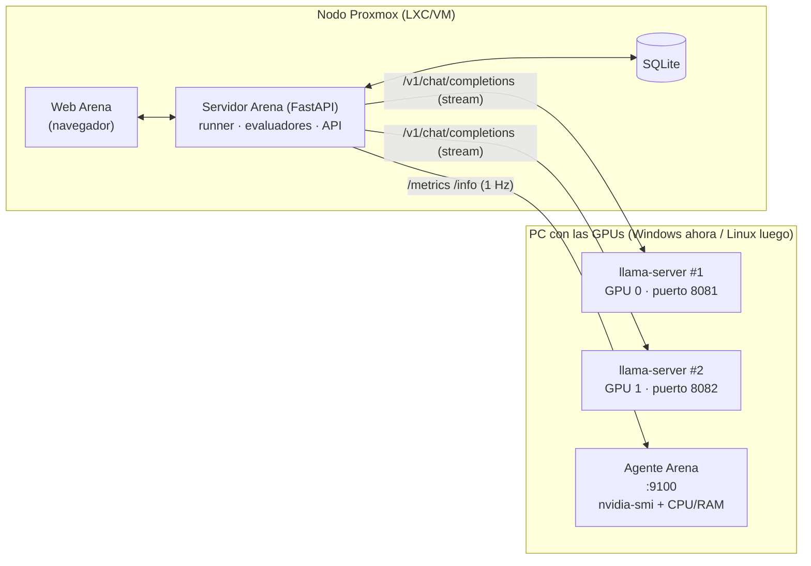

# Arena LLM — Banco de pruebas de modelos locales

> ⚠️ **Estudio inicial de viabilidad (03/10/2026).** Las decisiones y las fases vigentes están en [[03 - PROYECTOS TEC/Arena LLM/docs/HOJA-DE-RUTA|HOJA-DE-RUTA]] (v2) y el diseño de la interfaz en [[03 - PROYECTOS TEC/Arena LLM/docs/GUI-DISENO|GUI-DISENO]]. Este documento se conserva por el análisis de riesgos, la tabla de proyectos similares, las métricas y los datasets de pruebas (§6–§7), que siguen vigentes. Donde choque con la hoja de ruta v2, manda la v2.

> Creado 03/10/2026 — estudio de viabilidad + hoja de ruta para construirlo con Claude Code.
> **Estado:** 💡 Idea validada, sin código todavía. Este documento es el punto de partida: `Claude Code` debe leerlo entero antes de la Fase 0.

---

## 1. Qué es y para qué sirve

Software web propio (alojable en un nodo Proxmox) para **probar, medir y enfrentar modelos de IA locales** que corren en tus GPUs (RTX 3060 12 GB y Tesla M40), con datos suficientes para los vídeos de Impuls 16 y para decidir qué modelo usar en cada caso (Alfred, DopeHits, IA local para empresas).

**Lo que tiene que hacer (requisitos de Lucas, 03/10/2026):**

1. Pruebas de estrés **precargadas** (no hay que escribirlas cada vez).
2. **Guardar la configuración del PC/servidor** en cada prueba (CPU, RAM, GPUs, driver, versión de llama.cpp, flags, modelo).
3. Medir **velocidad** (tokens/s, tiempo al primer token), **estrés**, **temperaturas**, **consumo/TDP** y *todos* los datos de la tarjeta.
4. Guardar también **prompt, salida de código y respuesta** de cada prueba.
5. **Batalla:** un modelo en una tarjeta contra otro en la otra (o el mismo prompt en dos configuraciones).
6. **Todos los parámetros de la batalla editables desde la interfaz.**
7. Guardar resultados y métricas, y **comparar los que elija** (cualquier número de runs guardados).
8. Muy detallado y respaldado por buenos datos, para poder comparar todos los aspectos.

**Decisiones ya tomadas (respuestas de Lucas):**

| Tema | Decisión |
|---|---|
| Motor | **llama.cpp (`llama-server`)**, probablemente **varias instancias** (una por GPU, cada una con su puerto y su interfaz) |
| GPUs | **Tesla M40** (a comprar/instalar) + **RTX 3060 12 GB** |
| SO | **Windows ahora**, Linux (dual boot) más adelante → todo debe funcionar en ambos |
| Interfaz | **Web local**, alojada en un nodo Proxmox, conectando a los endpoints que haga falta |
| Pruebas v1 | Estrés GPU/VRAM · Calidad de código · Razonamiento/respuesta · Contexto largo y concurrencia |

---

## 2. Veredicto de viabilidad

**Viable.** Cada capacidad ya la resuelve algún proyecto abierto por separado; **ninguno junta las cinco** (batalla simultánea + telemetría de GPU sincronizada + calidad + historial + parámetros editables). Conclusión: se construye un **orquestador fino propio** reutilizando métodos, datasets y formatos ajenos. No hay nada que forkear y ya sirva.

### Qué es fácil
- Medir tokens/s y TTFT contra un endpoint compatible con OpenAI (`llama-server` lo es).
- Leer temperatura, potencia, VRAM, reloj y *throttling* con `nvidia-smi`.
- Guardar todo en SQLite y comparar en una web.

### Riesgos reales y cómo mitigarlos

| Riesgo | Por qué importa | Mitigación |
|---|---|---|
| **La M40 es Maxwell (compute 5.2)** | CUDA 13 ya no la soporta; solo funciona con builds de **CUDA 12.x** (en Windows, el asset `cuda-12.4` de llama.cpp). Requiere driver reciente que aún la soporte. | Fase 0: validar la M40 con `llama-bench` **antes** de escribir código. Fijar versión de llama.cpp/CUDA en la ficha de cada run. |
| **M40 pasiva (sin ventilador)** | `nvidia-smi` devuelve N/A en fan; se calienta y hace *throttling*. Es el dato más interesante para vídeo. | Registrar `throttle reasons` y reloj SM a lo largo del tiempo; avisar en la UI si hay N/A. |
| **M40 en Windows: modo de driver** | Las Tesla suelen ofrecer WDDM/TCC; puede afectar a VRAM disponible y a `nvidia-smi`. | **Por verificar en Fase 0** (no está confirmado en las fuentes). |
| **Numeración de GPUs** | Por defecto CUDA ordena "más rápida primero"; `nvidia-smi` ordena por bus PCI. Si no coinciden, mides la tarjeta equivocada. | Lanzar cada `llama-server` con `CUDA_DEVICE_ORDER=PCI_BUS_ID` y `CUDA_VISIBLE_DEVICES=<n>`; el programa asocia endpoint ↔ GPU y lo comprueba comparando VRAM usada. |
| **Equidad de la batalla** | Dos GPUs comparten CPU, RAM y PCIe; la caché de prompt falsea resultados. | Misma semilla, `cache_prompt=false` por defecto, registrar todos los parámetros y flags de cada lado; opción de ejecución **secuencial** además de paralela. |
| **Potencia ≠ consumo real** | `nvidia-smi` mide la placa, no el enchufe. | Etiquetarlo en la UI como "potencia de placa"; opcional futuro: enchufe inteligente/medidor. |
| **Ejecutar código del modelo** | Código no fiable en tu máquina. | Subproceso aislado con timeout, sin red; en Linux, contenedor. Nunca ejecutar en el nodo que aloja datos importantes. |
| **`timings` solo en llama.cpp** | Las métricas del servidor (prompt/gen por segundo) son propias de `llama-server`. | Medir siempre también en el cliente; usar `timings` cuando exista. **Verificar el campo en tu build.** |
| **Muestreo con `nvidia-smi`** | Lanzar el proceso 1 vez/s cuesta ~50-150 ms en Windows. | Aceptable a 1 Hz; cachear en el agente y, si molesta, pasar a `nvidia-smi -lms` o NVML. |

**Referencia de sanidad para la M40** (Llama 2 7B Q4_0, `llama-bench`): ~283 t/s en prompt (pp512) y ~38 t/s en generación (tg128), según la [discusión de rendimiento de llama.cpp](https://github.com/ggml-org/llama.cpp/discussions/15013). Si tu M40 está muy lejos, hay problema de driver, PCIe o refrigeración.

---

## 3. Proyectos existentes que encajan (qué reutilizar)

| Proyecto | Qué es | Qué reutilizar | Licencia |
|---|---|---|---|
| [llama-bench](https://github.com/ggerganov/llama.cpp/blob/b8c1476e44cc1f3a1811613f65251cf779067636/examples/llama-bench) | Benchmark oficial de llama.cpp (pp/tg en t/s con repeticiones; salida md/CSV/JSON/SQL) | Modo "benchmark puro" invocando el binario; su salida incluye CPU, GPU, CUDA y commit de la build → ficha de hardware | MIT |
| [GuideLLM](https://github.com/vllm-project/guidellm) | Carga realista contra endpoints OpenAI-compatibles (TTFT, ITL; perfiles síncrono/concurrente/barrido) | Modelo de la prueba de concurrencia y de las métricas TTFT/ITL | Apache 2.0 |
| [LocalScore](https://builders.mozilla.org/announcing-localscore/) (Mozilla) | Benchmark local: prompt, generación, TTFT; base de resultados pública | Idea de tests normalizados y puntuación única comparable | Apache 2.0 |
| [Verbodus](https://github.com/w512/verbodus) | App de escritorio: TTFT/TPOT/TPS en vivo, comparación de hasta 4 runs, concurrencia | **Solo inspiración de UI** (gráfica TPS en vivo, semáforos por umbral) | GPL v3 ⚠️ no copiar código |
| [local-llm-benchmark](https://github.com/kaushall13/local-llm-benchmark) | Script Python con Ollama + `pynvml` + panel Rich | Ejemplo de muestreo de VRAM/CPU durante la inferencia | MIT |
| [nvidia_gpu_exporter](https://github.com/utkuozdemir/nvidia_gpu_exporter) | Exporter Prometheus basado en `nvidia-smi`, funciona en Windows | **Autodescubrimiento de campos de `nvidia-smi`** (compatible con GPUs antiguas) | MIT |
| [EvalPlus](https://pypi.org/project/evalplus/) | HumanEval+ / MBPP+ con muchos más tests y ejecución controlada | Dataset de problemas de código reales (Fase 5) | Apache 2.0 |
| [promptfoo](https://www.promptfoo.dev/docs/guides/compare-open-source-models) | Evals YAML con comparación lado a lado y visor web | Tipos de aserción (contiene, regex, LLM-juez) y formatos de exportación | MIT |
| [Open WebUI Arena](https://docs.openwebui.com/features/evaluation) | Comparación ciega con votos y ranking Elo | Idea de votación humana A vs B con Elo (Fase extra) | Licencia propia de Open WebUI |
| Grafana + DCGM / exporter | Paneles de GPU en Prometheus | **Alternativa**: si ya tienes Grafana en el homelab, se puede alimentar en paralelo | — |

**Qué NO reinventar:** el dataset de código (EvalPlus), el método de carga/concurrencia (GuideLLM) y el descubrimiento de campos de `nvidia-smi` (nvidia_gpu_exporter).
**Qué es propio de Arena:** la batalla simultánea con telemetría sincronizada, el historial comparable y los parámetros editables por lado.

---

## 4. Arquitectura propuesta



### Componentes

1. **Agente Arena** (en el PC de las GPUs). Script Python **solo con biblioteca estándar** (sin `pip install`, ideal para Windows) + `nvidia-smi`. Expone por HTTP:
   - `GET /info` → hostname, SO, CPU, núcleos, RAM, driver, versión CUDA, y por GPU: nombre, UUID, VRAM total, BIOS, bus PCI, límite de potencia, relojes máximos.
   - `GET /metrics` → por GPU: temperatura, potencia, límite de potencia, utilización GPU/memoria, VRAM usada/total, reloj SM/mem, fan, pstate, **motivos de throttling** (bitmask), PCIe gen/ancho; más CPU % y RAM.
   - Token opcional (`X-Token`). Si un campo de `nvidia-smi` no existe en ese driver, **se descarta y se reintenta** (técnica de nvidia_gpu_exporter). Valores `N/A` → `null`.
2. **Servidor Arena** (Python + FastAPI + httpx + SQLite). Gestiona equipos/endpoints, lanza runs, hace *streaming* contra `llama-server`, muestrea telemetría, evalúa respuestas, guarda todo y sirve la web. Eventos en vivo por SSE.
3. **Web Arena** (sin paso de compilación: HTML + JS vanilla, **Chart.js vendorizado en local** porque el homelab puede no tener internet). Pestañas: Batalla · Equipos · Historial · Comparar.
4. **Opcional futuro:** el agente también arranca/para `llama-server` (cambiar modelo y flags desde la UI). En v1 los `llama-server` los lanzas tú.

### Lanzar un `llama-server` por GPU (referencia)

```bat
:: Windows (cmd) — GPU 0 = RTX 3060
set CUDA_DEVICE_ORDER=PCI_BUS_ID
set CUDA_VISIBLE_DEVICES=0
llama-server -m modelo_a.gguf -ngl 99 -c 8192 --parallel 4 --port 8081 --host 0.0.0.0
:: segunda ventana — GPU 1 = M40
set CUDA_DEVICE_ORDER=PCI_BUS_ID
set CUDA_VISIBLE_DEVICES=1
llama-server -m modelo_b.gguf -ngl 99 -c 8192 --parallel 4 --port 8082 --host 0.0.0.0
```
> Comprueba en Fase 0 qué índice es cada tarjeta con `nvidia-smi`. `--parallel N` es necesario para la prueba de concurrencia (cada petición simultánea usa un *slot*; el contexto `-c` se reparte entre ellos).

---

## 5. Modelo de datos (SQLite)

| Tabla | Campos clave |
|---|---|
| `targets` | id, nombre, `base_url` (llama-server), `agent_url`, `gpu_indices`, api_key, alias de modelo, notas, parámetros por defecto (JSON) |
| `runs` | id, `battle_id`, etiqueta, suite, config (JSON: parámetros + opciones de la suite), target_id, **`target_snapshot`** (JSON: info del agente + `/props` + `/v1/models` en el momento), estado, inicio/fin, `t_load_start/end`, **`summary`** (JSON), error |
| `items` | id, run_id, idx, nombre, **prompt, respuesta, razonamiento**, `metrics` (JSON), `eval` (JSON: pasa/falla, puntuación, detalle, **salida de código y errores**), error |
| `samples` | run_id, t, gpu, temp, potencia, util, vram_usada/total, reloj_sm, reloj_mem, fan, throttle (bitmask), cpu, ram |
| `tps_series` | run_id, t, tps, tokens (serie de velocidad segundo a segundo) |

**Regla de oro:** todo run guarda **su propia foto de configuración** (`target_snapshot` + `config`). Comparar dentro de 6 meses debe seguir teniendo sentido aunque cambies de driver, de llama.cpp o de modelo.

---

## 6. Métricas que se guardan

| Métrica | Unidad | Cómo se obtiene |
|---|---|---|
| Tokens/s de generación | t/s | `timings.predicted_per_second` de llama-server; si no, cliente: (tokens−1) / tiempo desde el 1er token |
| Tokens/s de procesado de prompt | t/s | `timings.prompt_per_second` |
| TTFT (tiempo al primer token) | s | cliente: envío → primer chunk |
| Latencia total | s | cliente |
| Tokens de prompt / generados | nº | `usage` o `timings`; si falta, nº de chunks |
| Mediana, p10, mín, máx, desviación de t/s | t/s | sobre las peticiones del run |
| **Degradación** (primer 20 % vs último 20 %) | % | `tps_series`, solo runs ≥ 30 s |
| Temperatura GPU (reposo, media, máx) | °C | `samples`; reposo = línea base previa a la carga |
| Subida de temperatura | °C | máx − reposo |
| Potencia (reposo, media, máx) | W | `samples` |
| **Energía** | Wh | integral trapezoidal de la potencia en la ventana de carga |
| **Eficiencia** | tokens/Wh y Wh/1000 tokens | tokens generados / energía |
| Utilización GPU / memoria | % | `samples` |
| VRAM pico | MiB | `samples` (también por ítem: VRAM vs tamaño de contexto) |
| Reloj SM (medio, mín) | MHz | `samples`; caída = throttling |
| **% de tiempo con throttling** | % | bitmask: térmico (`0x20`,`0x40`), potencia (`0x04`,`0x80`), HW slowdown (`0x08`) |
| Fan, pstate, PCIe gen/ancho | — | `samples` / ficha |
| CPU % y RAM del host | % | agente |
| Calidad | % aciertos | evaluadores (§7) |

> Máscara de *throttle reasons* (NVML): `0x1` idle · `0x2` app clocks · `0x4` power cap SW · `0x8` slowdown HW · `0x20` térmico SW · `0x40` térmico HW · `0x80` power brake. Verificar en tu driver.

---

## 7. Pruebas precargadas (v1)

Todas deterministas (semilla fija) y con **opciones editables** desde la UI.

### 7.1 Estrés GPU/VRAM (`estres`)
Bucle de peticiones largas (rotando temas) durante `duracion_s` (por defecto 120) con `paralelo` hilos (por defecto 1) y `max_tokens` por petición. Mide t/s a lo largo del tiempo, temperatura, potencia, reloj y throttling. **Resultado estrella:** curva de t/s y temperatura vs tiempo, % de degradación, energía y tokens/Wh. Opciones útiles: `reposo_antes_s` (línea base), `enfriamiento_despues_s` (captura la curva de enfriado).

### 7.2 Razonamiento / respuesta (`qa`)
Preguntas con respuesta conocida. El prompt exige acabar con una línea `RESPUESTA: <valor>`; se compara con normalización (números con coma/punto, mayúsculas, acentos). Semillas de dataset:

| # | Pregunta (resumen) | Respuesta |
|---|---|---|
| 1 | 3 máquinas hacen 3 piezas en 3 min → ¿minutos para 100 máquinas y 100 piezas? | 3 |
| 2 | 17 × 24 | 408 |
| 3 | 5 manzanas, me como 2, compro el triple de las que me quedan → ¿cuántas tengo? | 12 |
| 4 | Capital de Australia | Canberra |
| 5 | Serie 2, 6, 12, 20, 30, ? | 42 |
| 6 | Bate y pelota: 1,10 € entre los dos, el bate cuesta 1 € más que la pelota → pelota (€) | 0,05 |
| 7 | Días de feb + mar + abr en año no bisiesto | 89 |
| 8 | Ana > Beto > Carla > Dani en altura → segunda más baja | Carla |
| 9 | Segundos en 2,5 horas | 9000 |
| 10 | Todos los bloops son razzies y todos los razzies son lazzies → ¿todos los bloops son lazzies? (sí/no) | sí |
| 11 | "linux" al revés | xunil |
| 12 | Nº de letras "r" en "carretera" | 3 |

Ampliable desde la UI (pegar preguntas + respuesta esperada) y, más adelante, con un banco mayor y/o **LLM-juez** (promptfoo `llm-rubric`).

### 7.3 Calidad de código (`codigo`)
El modelo escribe la función; Arena extrae el bloque ```python, **lo ejecuta en subproceso aislado** (timeout 10 s, sin stdin) junto a los tests y marca pasa/falla. Se guarda el código, la salida estándar y los errores. Semillas (10 problemas, 3 niveles):

| # | Función | Comprueba |
|---|---|---|
| 1 | `es_palindromo(s)` | ignora mayúsculas/espacios/signos; cadena vacía |
| 2 | `dos_suma(nums, objetivo)` | índices (i, j), i < j |
| 3 | `fusionar_intervalos(intervalos)` | orden, solapes, borde, lista vacía |
| 4 | `romano_a_entero(s)` | III, LVIII, MCMXCIV, IX |
| 5 | `aplanar(lista)` | anidamiento arbitrario; **las cadenas no se desglosan** |
| 6 | `parentesis_validos(s)` | `()[]{}`, `(]`, `((`, vacío |
| 7 | `class LRUCache(capacidad)` | `get/put`, expulsión del menos usado |
| 8 | `frecuencias_top(texto, k)` | minúsculas, sin puntuación, desempate alfabético |
| 9 | `fibonacci_mod(n, m)` | n hasta 10^18 → exige algoritmo rápido (trampa de rendimiento); **calcular el valor esperado con una implementación de referencia** |
| 10 | `contar_islas(grid)` | matriz de 0/1, vacía, sin islas |

Métrica: **pass@1** y tiempo/tokens por problema. Fase posterior: sustituir/ampliar con **HumanEval+/MBPP+ (EvalPlus)**.

### 7.4 Contexto largo (`contexto`)
"Aguja en un pajar": texto de relleno determinista (semilla) con una frase secreta insertada en una profundidad concreta; se pregunta por el código. Tamaños por defecto 2k/4k/8k tokens (hasta 32k), profundidades 10 %/50 %/90 %. Mide **t/s de procesado de prompt**, TTFT, **VRAM pico vs contexto** y acierto. Los tokens reales salen de `usage`/`timings` (la estimación por caracteres es solo orientativa). Si el contexto no cabe, se registra el error como resultado (útil para conocer el límite de cada tarjeta).

### 7.5 Concurrencia (`concurrencia`)
Niveles N = 1, 2, 4 (editable) peticiones simultáneas con el mismo prompt. Mide t/s **por petición** y **agregado**, TTFT y latencia. Requiere `--parallel ≥ N` en `llama-server`.

### 7.6 Prompt libre (`libre`)
Uno o varios prompts propios (separados por `---`), con repeticiones. Sin evaluación automática. Pensado para demos de vídeo.

---

## 8. Batalla y parámetros editables

**Batalla = misma prueba, 2 o más "lados" lanzados a la vez** (modo paralelo) o uno tras otro (secuencial). Cada lado elige **equipo/endpoint** y tiene sus **propios parámetros**; todos se pueden editar en la interfaz antes de lanzar:

- Lado: etiqueta, equipo/endpoint, prompt de sistema.
- Muestreo: `temperature`, `top_p`, `top_k`, `min_p`, `repeat_penalty`, `presence_penalty`, `frequency_penalty`, `seed`, `max_tokens`, `stop`.
- Caché: `cache_prompt` (por defecto **desactivada** para medir justo).
- Pasarela libre: JSON `extra` para cualquier campo del servidor (p. ej. desactivar el modo "thinking").
- Prueba: la suite y sus opciones (duración, tamaños de contexto, niveles de concurrencia, preguntas…).
- Ejecución: modo paralelo/secuencial, línea base antes (s), enfriamiento (s), intervalo de muestreo (s), timeout por petición (s).
- Botón **"Copiar A→B"** para variar un solo parámetro y ver su efecto.

Vista en vivo: columna por lado con respuesta en *streaming*, t/s, TTFT, temperatura, potencia, VRAM, reloj, progreso y mini-gráficas. Al terminar: tabla resumen con el mejor valor resaltado.

**Nota de límites:** el tamaño de contexto (`-c`), las capas en GPU (`-ngl`) y el modelo se fijan al arrancar `llama-server`; la UI los **registra** (vía `/props`) pero no los cambia en v1.

---

## 9. Historial y comparación

- **Historial:** lista filtrable (suite, equipo, texto), con velocidad, % acierto, temperatura máx y potencia media; etiquetas y notas editables; borrar.
- **Comparar (cualquier selección de runs guardados):**
  - Tabla de métricas con el mejor valor resaltado (mayor es mejor / menor es mejor según la métrica).
  - Gráficas superpuestas: t/s, temperatura, potencia, VRAM y reloj vs tiempo; barras de métricas clave; VRAM vs contexto; t/s agregado vs concurrencia.
  - Matriz por ítem (mismos prompts): pasa/falla y t/s lado a lado, con respuestas desplegables.
  - Ficha de configuración de cada run (diferencias resaltadas).
- **Exportar:** JSON, CSV y **Markdown para el vault** (tabla resumen lista para pegar en una nota o en `wiki/`), más imagen de las gráficas para los vídeos.

---

## 10. Hoja de ruta por fases (para Claude Code)

> Una fase = un bloque de trabajo con **criterios de aceptación** comprobables. Commits en español (`feat:`, `fix:`, `chore:`), uno por hito. Probar con un **`llama-server` simulado** (mock) cuando no haya GPU y con el real cuando la haya. No pasar de fase sin cumplir los criterios.

### Fase 0 — Banco de pruebas físico (Lucas + Claude, sin código del proyecto)
**Objetivo:** confirmar que el hardware y el software base funcionan.
- [ ] M40 y 3060 visibles en `nvidia-smi`; anotar índice, modo de driver y driver.
- [ ] Descargar el build de llama.cpp compatible con la M40 (CUDA 12.x) y verificar que ambas tarjetas funcionan.
- [ ] `llama-bench` con un modelo pequeño en cada tarjeta; comparar con la referencia (~283 / ~38 t/s en M40 con 7B Q4_0).
- [ ] Dos `llama-server` (puertos 8081/8082) con `CUDA_DEVICE_ORDER=PCI_BUS_ID`; comprobar que cada uno ocupa VRAM en la tarjeta esperada.
- [ ] Confirmar qué campos de `nvidia-smi` devuelve la M40 (fan, throttle reasons…).
- [ ] Verificar que `/v1/chat/completions` con `stream:true` devuelve `timings` y `usage` en el último chunk y que `/props` funciona.
- [ ] Decidir dónde se aloja el servidor (LXC/VM en Proxmox) y red/IPs.
**Entregable:** nota con driver, versión de llama.cpp, flags y resultados de `llama-bench` (será la primera "ficha de referencia").

### Fase 1 — Esqueleto y agente de GPU
**Entregables:** repo con la estructura (`agent/`, `arena/`, `static/`, `tests/`), `README`, scripts de arranque `.bat` y `.sh`; **agente** con `/health`, `/info`, `/metrics`; modo simulado sin GPU.
- [ ] El agente corre en Windows con solo Python estándar y devuelve datos de ambas GPUs.
- [ ] Campos no soportados → `null` sin romper; campo inválido en el driver → se descarta y reintenta.
- [ ] Decodificación de *throttle reasons* con tests unitarios.

### Fase 2 — Núcleo: un prompt, un equipo
**Entregables:** servidor FastAPI + SQLite; CRUD de equipos; botón "probar conexión" (llama `/props`, `/v1/models`, agente); **runner** con *streaming* que calcula TTFT, t/s (servidor y cliente), tokens y guarda `prompt/respuesta/métricas`; suite `libre`.
- [ ] Un prompt contra un `llama-server` real guarda un run completo con métricas coherentes con `llama-bench`.
- [ ] Soporta modelos con razonamiento (`reasoning_content`) guardándolo aparte.
- [ ] Errores (contexto excedido, endpoint caído) se guardan como resultado, no tiran el servidor.
- [ ] Tests con servidor simulado.

### Fase 3 — Telemetría sincronizada y resumen
**Entregables:** muestreo del agente durante el run (línea base + carga + enfriamiento opcional); `samples` y `tps_series`; cálculo de resumen (energía, tokens/Wh, throttling, degradación, VRAM pico, estadísticas de t/s); **UI en vivo** con SSE y gráficas.
- [ ] Gráfica en vivo de t/s, temperatura, potencia y VRAM durante un run.
- [ ] El resumen coincide con un cálculo manual sobre los datos guardados (test).
- [ ] Un run con el agente caído termina igualmente, marcando telemetría ausente.

### Fase 4 — Pruebas precargadas (sin código)
**Entregables:** suites `estres`, `qa`, `contexto`, `concurrencia` con sus opciones editables y evaluadores.
- [ ] Mismas semillas ⇒ mismos prompts en cualquier ejecución.
- [ ] `estres` produce curva de degradación y eficiencia; `contexto` produce VRAM-vs-contexto; `concurrencia` produce t/s agregado por nivel.
- [ ] `qa`: normalización de respuestas probada con casos límite.

### Fase 5 — Calidad de código
**Entregables:** suite `codigo` con ejecución aislada; guardado de código, salida y errores; después integración de **EvalPlus** (HumanEval+/MBPP+) como dataset ampliado.
- [ ] Código malicioso/infinito (bucle, `input()`, escritura de ficheros) no bloquea ni daña el servidor (timeout, sin stdin, directorio temporal, sin red).
- [ ] Resultado por problema y pass@1.

### Fase 6 — Batalla
**Entregables:** lanzamiento de 2+ lados (paralelo/secuencial) con parámetros editables por lado, vista en vivo en columnas, copia A→B, `battle_id` común.
- [ ] Dos lados simultáneos en M40 y 3060 con telemetría separada por GPU.
- [ ] Cambiar un parámetro de un lado se refleja en el JSON del run guardado.
- [ ] Prompts y semillas idénticos en ambos lados (verificado en test).

### Fase 7 — Historial, comparación y exportación
**Entregables:** historial filtrable, edición de etiquetas/notas, comparador (tabla + gráficas superpuestas + matriz por ítem + diff de configuración), exportar JSON/CSV/**Markdown para el vault**/PNG.
- [ ] Comparar 5+ runs a la vez sin errores.
- [ ] El Markdown exportado se pega en el vault con YAML válido (ver `CLAUDE.md` del vault).

### Fase 8 — Pulido y despliegue
**Entregables:** despliegue en Proxmox (LXC/Docker), arranque del agente como servicio (Windows y Linux), autenticación básica/token, copia de seguridad de la BD, **modo vídeo** (pantalla limpia, tamaños grandes), documentación de uso.
- [ ] Funciona igual tras el **dual boot a Linux** (solo cambian rutas y scripts).
- [ ] Documentado cómo añadir una GPU o un endpoint nuevo.

### Fase 9 — Extras (backlog)
- Modo `llama-bench` integrado (benchmark estándar, comparable con la comunidad).
- Votación humana ciega A vs B con ranking **Elo** (idea de Open WebUI).
- **LLM-juez** para respuestas abiertas.
- Control de `llama-server` desde la UI (cambiar modelo/flags).
- Medición de potencia real con enchufe inteligente.
- Soporte de otros motores (Ollama, vLLM) y otras GPUs (AMD/Intel).
- Alertas (temperatura crítica → abortar el run).
- Puntuación única tipo "ArenaScore" para ranking rápido.

---

## 11. Reglas para Claude Code (copiar al `CLAUDE.md` del repo)

1. **Leer este documento entero** antes de empezar, y `ESTADO.md` del repo al retomar.
2. Stack fijado: Python 3.10+, FastAPI, httpx, SQLite (stdlib), frontend sin compilar (HTML/JS vanilla). **El agente solo con biblioteca estándar.** No añadir dependencias pesadas sin preguntar.
3. Todo debe funcionar en **Windows y Linux**: usar `pathlib`, nada de rutas con `\` fijas, scripts `.bat` y `.sh`.
4. **Sin internet en el homelab:** nada de CDN en producción; vendorizar librerías (Chart.js) en `static/vendor/`.
5. Cada run guarda **su foto de configuración** completa. Nunca depender de ajustes globales para interpretar un resultado antiguo.
6. **No inventar datos:** si una métrica no está disponible (N/A del driver, `timings` ausente), guardar `null` y mostrarlo como "no disponible", nunca 0.
7. El código del modelo se ejecuta **siempre aislado** (subproceso, timeout, sin stdin, directorio temporal). Nunca `exec()` en el proceso del servidor.
8. Un commit por hito, mensajes en español (`feat:`, `fix:`, `chore:`). Tests unitarios para cálculos (energía, degradación, normalización de respuestas) y un `llama-server` simulado para pruebas sin GPU.
9. Antes de cada fase: listar qué se va a hacer; al terminar: comprobar los criterios de aceptación y actualizar `ESTADO.md`.
10. Datos de la BD y resultados reales no se suben al repositorio (`.gitignore`).
11. Si algo de este documento choca con la realidad del hardware (p. ej. la M40 no expone un campo), **parar y preguntar**, y anotar el cambio aquí.

---

## 12. Decisiones abiertas (para Lucas)

- [ ] ¿La M40 es de **12 GB o 24 GB**? Cambia qué modelos caben.
- [ ] ¿Dónde se aloja el servidor (nodo/LXC concreto) y si el PC de GPUs tiene IP fija?
- [ ] ¿Quieres que el agente pueda **arrancar y parar** `llama-server` desde la web ya en v1?
- [ ] ¿Algún límite de potencia o temperatura a partir del cual la prueba debe **abortarse sola** (para proteger la M40 pasiva)?
- [ ] ¿Qué modelos concretos quieres como baterías de comparación iniciales (para fijar la primera "tabla de oro")?
- [ ] ¿Nombre definitivo del proyecto? (provisional: **Arena LLM**).

---

## 13. Fuentes

- [llama-bench (llama.cpp)](https://github.com/ggerganov/llama.cpp/blob/b8c1476e44cc1f3a1811613f65251cf779067636/examples/llama-bench)
- [Rendimiento de llama.cpp en CUDA — discusión #15013 (incluye M40 y P40)](https://github.com/ggml-org/llama.cpp/discussions/15013)
- [CUDA deprecation y GPUs antiguas — Hardware Corner](https://www.hardware-corner.net/local-llm-cuda-deprecation-p40-v100-20250507/)
- [Pascal/Maxwell tras CUDA 13 — LocalAIMaster](https://localaimaster.com/blog/pascal-gpus-after-cuda-13) (blog; contrastar en Fase 0)
- [GuideLLM](https://github.com/vllm-project/guidellm)
- [LocalScore (Mozilla Builders)](https://builders.mozilla.org/announcing-localscore/)
- [Verbodus](https://github.com/w512/verbodus)
- [local-llm-benchmark](https://github.com/kaushall13/local-llm-benchmark)
- [nvidia_gpu_exporter](https://github.com/utkuozdemir/nvidia_gpu_exporter)
- [EvalPlus](https://pypi.org/project/evalplus/)
- [promptfoo — comparar modelos](https://www.promptfoo.dev/docs/guides/compare-open-source-models)
- [Open WebUI — evaluación y Arena](https://docs.openwebui.com/features/evaluation)

*Datos consultados el 03/10/2026. Los detalles marcados "por verificar" deben confirmarse en la Fase 0.*
